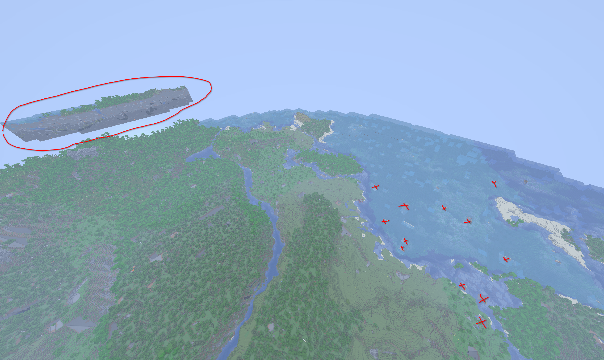
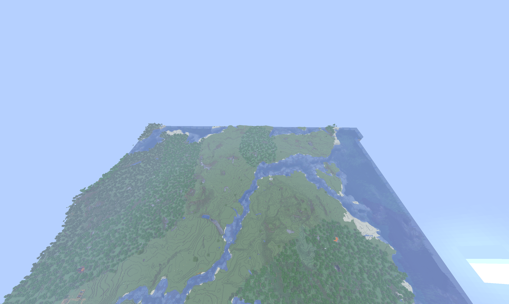

# VoxyServer-WorldGen Cap

Fabric mod that reduces server upload bandwidth when streaming Voxy LODs. Server-side only — clients don't need this mod.

## Results

Teleported to a distant location and stood still for about two minutes. Exact same config, just without voxyserver-worldgen-cap.

| Without the mod (~25 Mbit) | With the mod (~3 Mbit) |
|---|---|
|  |  |

Without the mod, the server pushes LOD data to the client every time a chunk finishes generating, with no rate limit. The upload spikes, distant terrain shows up before nearby terrain is ready (red ellipse), and some chunks never load at all (red X's).

With the mod, those instant pushes are turned off for newly-generated chunks. Instead, the server fills the LOD horizon at a steady rate, walking outward from the player. The result is a clean, even fill at a fraction of the bandwidth.

## What it does

Voxy and Voxy WorldGen V2 each send their own copy of LOD data on separate network channels every time a chunk finishes generating. The same terrain ends up on the wire twice, at whatever rate the world generator can produce it. This mod intercepts both at the source.

`NetworkHandlerMixin` cancels Voxy WorldGen V2's `broadcastLODData` and `sendLODData`. Voxy WorldGen V2 still pre-generates terrain — it just stops sending it to clients.

`LodStreamingServiceMixin` cancels VoxyServer's `pushDirtySection`, but only for newly-generated sections (the ones still in `initialLoadSections`). Player block edits travel through a different path (`markChunkPendingDirty` + `revoxelizeChunk`) that never touches `initialLoadSections`, so edits still get pushed instantly. The same mixin also bypasses VoxyServer's `isInitialLoadReady` 3-of-4-chunks safety check, which would otherwise drop sections before the version bump that the scan path needs to deliver them.

What's left is VoxyServer's existing scan path: every tick, it walks outward from each player and sends up to `maxSectionsPerTickPerPlayer` sections of LOD data. That rate is the new cap.

## Dependencies

- [VoxyServer](https://modrinth.com/mod/voxyserver) (server-side)
- [Voxy World Gen V2](https://modrinth.com/mod/voxy-worldgen) (server-side)
- [Voxy](https://modrinth.com/mod/voxy) (client-side renderer — already required by the others)

## Tested setup

Only the following combination has been tested:

| Mod | Version |
|---|---|
| Minecraft | 26.1.2 |
| Fabric Loader | 0.19.2 |
| Voxy | 0.2.15-beta+26.1 |
| VoxyServer | 1.1.6 |
| Voxy World Gen V2 | 26.1.2-2.2.4 |
| VoxyServer-WorldGen Cap | 1.0.0 |

Java 25.

## Minimal config

Reference values producing **~3 Mbit/player** at a **128-chunk LOD horizon**:

`config/voxyserver.json`:
```jsonc
{
  "lodStreamRadius": 128,              // default: 256
  "maxSectionsPerTickPerPlayer": 30,   // default: 100
  "sectionsPerPacket": 15              // default: 50
}
```

`config/voxyworldgenv2.json`:
```jsonc
{
  "maxActiveTasks": 10                 // optional — default: 20
}
```

Scale `maxSectionsPerTickPerPlayer` and `sectionsPerPacket` up together to trade bandwidth for fill speed.

## Caveats

The fresh-vs-edit discriminator relies on `markChunkPendingInitialLoad` being the only path that populates `initialLoadSections`. If a future VoxyServer release changes which paths touch that map, the mod could mis-classify block edits or fresh loads. Re-verify if you upgrade VoxyServer past 1.1.6.

## How this was made

Vibe-coded in one session with Claude Opus 4.7 against the decompiled VoxyServer 1.1.6 and Voxy WorldGen V2 sources. No formal tests, no upstream involvement from either mod's author. It works on my server with the config above — that's the extent of what I can promise. Use at your own risk.

## License

MIT.
